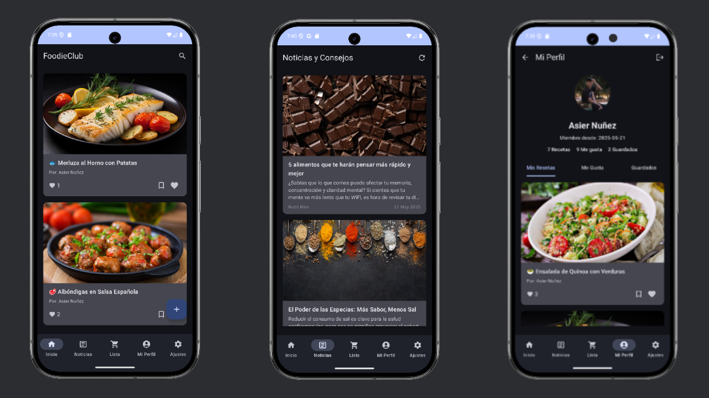

#  FoodieClub 🍲✨

<!-- Opcional: Si subes la imagen a tu repositorio, por ejemplo en una carpeta "assets": -->
<!--  -->

Bienvenido a FoodieClub, tu compañero culinario definitivo. Descubre, crea, comparte y organiza tus recetas favoritas, ¡todo en un solo lugar! Además, obtén información nutricional estimada para tus platos con nuestra innovadora función de IA. Por AsierNG.

## 📜 Descripción

FoodieClub es una aplicación móvil Android desarrollada como Trabajo de Fin de Ciclo (TFC), diseñada para entusiastas de la cocina de todos los niveles. El objetivo principal es proporcionar una plataforma intuitiva y rica en funciones para mejorar la experiencia en la cocina, desde la inspiración hasta la organización.

La aplicación permite a los usuarios explorar una variedad de recetas, añadir sus propias creaciones, gestionar una lista de la compra personalizada y obtener un análisis nutricional aproximado de los ingredientes mediante la integración con la API de Google AI (Gemini).

## ✨ Características Principales

*   **🍳 Explorar y Descubrir Recetas:** Accede a un catálogo de recetas para encontrar inspiración culinaria.
*   **✍️ Crear Recetas Propias:** Los usuarios pueden documentar y guardar sus propias recetas, detallando ingredientes, pasos de preparación e imágenes.
*   **❤️ Favoritos y Guardados:** Funcionalidad para marcar y organizar las recetas preferidas para un fácil acceso.
*   **📰 Noticias y Consejos:** Una sección con artículos y consejos relacionados con el mundo de la cocina, nutrición y gastronomía.
*   **🛒 Lista de la Compra:**
    *   Crea y gestiona una lista de la compra personal.
    *   Añade ítems manualmente.
    *   Marca ítems como comprados y elimina los completados.
*   **🤖 Estimación Nutricional con IA (Gemini):**
    *   Una característica innovadora que permite a los usuarios obtener una estimación de la información nutricional (calorías, macronutrientes, etc.) para una lista de ingredientes, utilizando la API de Google AI (Gemini).
*   **👤 Perfiles de Usuario:** Cada usuario tiene un perfil donde puede ver sus recetas creadas, actividad y gestionar su cuenta.
*   **🔒 Autenticación Segura:** Implementación de inicio de sesión y registro mediante correo electrónico/contraseña, así como inicio de sesión simplificado con Google Sign-In, todo gestionado a través de Firebase Authentication.

## 🛠️ Tecnologías y Metodología

### Tecnologías Utilizadas:

*   **Lenguaje de Programación:** Kotlin
*   **Arquitectura:** MVVM (Model-View-ViewModel) para una estructura de código organizada y mantenible.
*   **Interfaz de Usuario (UI):** Jetpack Compose, el moderno toolkit de Android para la creación de interfaces nativas.
*   **Navegación:** Jetpack Navigation Compose para gestionar los flujos de navegación dentro de la app.
*   **Programación Asíncrona:** Kotlin Coroutines y StateFlow para operaciones en segundo plano y gestión de estado reactiva.
*   **Backend y Base de Datos (BaaS):**
    *   **Firebase Authentication:** Para la gestión de usuarios.
    *   **Cloud Firestore:** Base de datos NoSQL para almacenar recetas, artículos, listas de la compra y datos de usuario.
    *   **Firebase Storage:** Para el almacenamiento de imágenes de recetas y artículos.
*   **Inteligencia Artificial:**
    *   **Google AI (Gemini API):** Para la funcionalidad de estimación nutricional.
*   **Networking:**
    *   Ktor (utilizado internamente por el SDK de Gemini).
    *   Retrofit (si se utilizó para alguna otra API).
*   **Serialización de Datos:** Gson (para procesar respuestas JSON, especialmente de la IA).
*   **Carga de Imágenes:** Coil.
*   **Entorno de Desarrollo Integrado (IDE):** Android Studio.
*   **Control de Versiones:** Git y GitHub.

### Metodología de Desarrollo:

El desarrollo de "FoodieClub" se abordó siguiendo una **Metodología de Desarrollo Iterativo e Incremental, con Asistencia de Inteligencia Artificial (IA)**. El proyecto se descompuso en módulos funcionales (autenticación, recetas, noticias, lista de la compra, IA nutricional), desarrollados en ciclos. Cada iteración producía un incremento funcional de la aplicación, permitiendo pruebas continuas.

La Inteligencia Artificial no solo fue una característica del producto final, sino también una herramienta de apoyo durante el desarrollo, asistiendo en la resolución de problemas técnicos complejos (ej. configuraciones de ProGuard, depuración de API), generación de fragmentos de código, y comprensión de nuevas tecnologías, agilizando así el proceso general.

## ⚙️ Configuración del Proyecto (Para Desarrolladores)

1.  **Clonar el Repositorio:**
    ```bash
    git clone https://github.com/AsierCode/FoodieClub
    cd TU_NOMBRE_REPOSITORIO
    ```
2.  **Configurar Firebase:**
    *   Crea un proyecto en [Firebase Console](https://console.firebase.google.com/).
    *   Añade una aplicación Android con el nombre de paquete `com.example.foodieclub` (o el que corresponda a tu proyecto).
    *   Descarga el archivo `google-services.json` generado y colócalo en el directorio `app/` del proyecto.
    *   En la consola de Firebase, habilita los siguientes servicios:
        *   Authentication (con proveedores Email/Password y Google).
        *   Firestore Database (Cloud Firestore).
        *   Storage (Firebase Storage).
    *   Añade las huellas digitales SHA-1 de tus certificados de depuración y lanzamiento en la configuración de tu app Android en Firebase para el correcto funcionamiento de Google Sign-In.
    *   Define las Reglas de Seguridad para Firestore y Storage para proteger los datos de los usuarios.

3.  **Configurar API Keys (local.properties):**
    *   Crea un archivo `local.properties` en la raíz del proyecto (si no existe).
    *   Añade tus API keys necesarias. Como mínimo, la de Gemini:
        ```properties
        GEMINI_API_KEY="TU_API_KEY_DE_GOOGLE_AI_STUDIO_PARA_GEMINI"
        ```
4.  **Sincronizar y Construir:**
    *   Abre el proyecto en la última versión estable de Android Studio.
    *   Permite que Gradle sincronice las dependencias.
    *   Construye y ejecuta la aplicación en un emulador o dispositivo físico.

## 🚀 Posibles Mejoras Futuras

*   Integración social más profunda (seguir usuarios, comentar recetas).
*   Añadir ingredientes a la lista de la compra directamente desde la vista de detalle de una receta.
*   Filtros avanzados para la búsqueda de recetas (por tipo de dieta, alérgenos, tiempo de preparación).
*   Planificador de comidas semanal.
*   Notificaciones personalizadas.
*   Mejoras en la interfaz de usuario y experiencia de usuario (UX).

## 📄 Licencia

Este proyecto se presenta como un Trabajo de Fin de Ciclo. FreeSource.

## 🙏 Agradecimientos

*   A Damian Sualdea por su invaluable guía y apoyo durante todo el desarrollo de este proyecto.
*   A las comunidades de desarrolladores y la extensa documentación proporcionada por Google para Android, Jetpack Compose, Firebase y Google AI.

---
